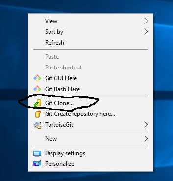
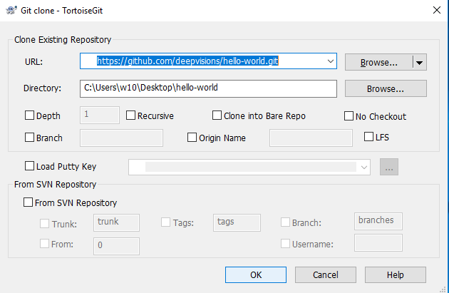
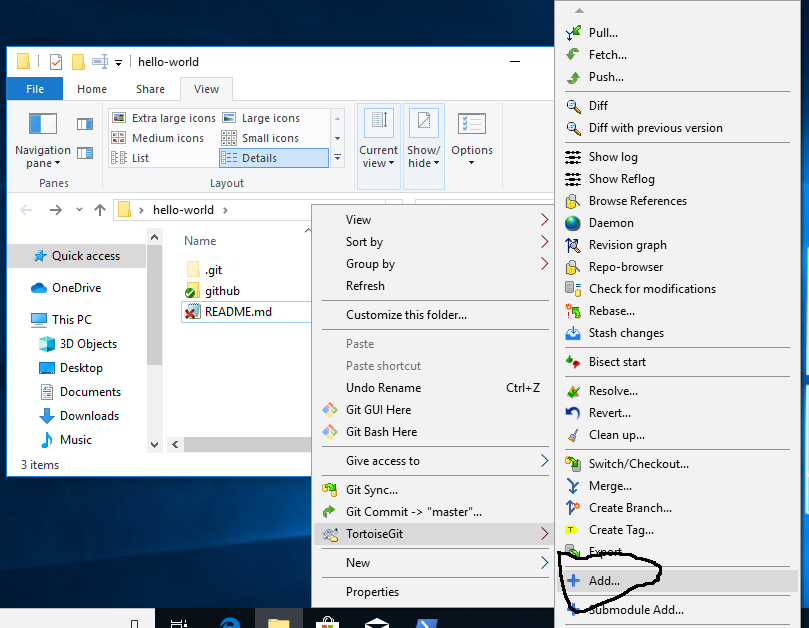
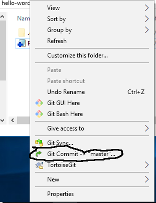
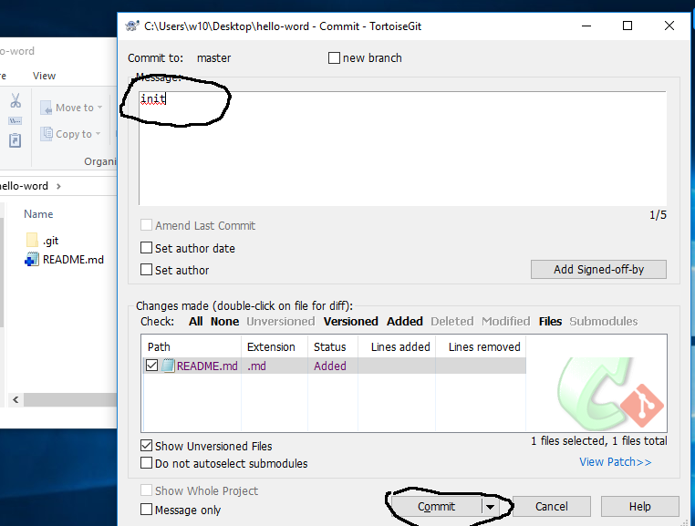
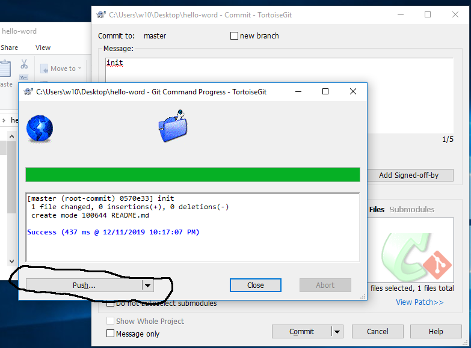
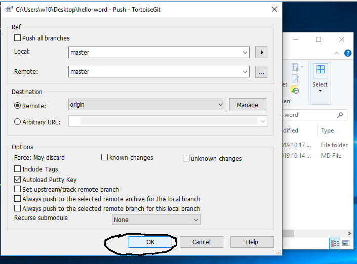
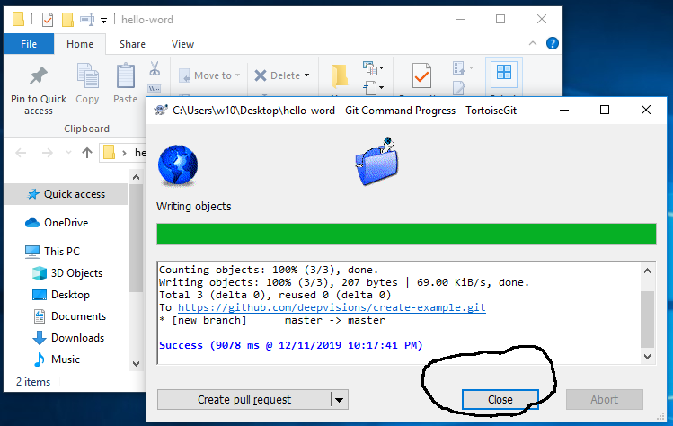

安装 git 和 tortoisegit
-----------------------

`参考 <tortoiseGit-tut.rst>`_ 

步骤0 创建repository
--------------------
**方法1**

登陆github(输入用户名和密码) 例如https://github.com/deepvisions 

1. 点击 repositories 

2. 点击 "New"

.. image:: img-github/github-create0.png

3. 输入项目名称

4. 点击 Create Repository

.. image:: img-github/github-create1.png

5. 复制url

.. image:: img-github/github-create2.png

6. 在windows桌面点击右键, 点击 "Git Clone", 然后点击 "OK" 

7. 桌面会生成一个名为hello-world的文件夹. 在文件夹内创建一个名为README拓展名为md的记事本文件

8. 右键点击README.md,然后点击"Add"  

9. 在文件夹空白处点击右键, 然后点击 "Git Commit->master"

10. 填写变更说明,然后点击 "Commit"

11. 点击 "Push", 然后点击"OK"

12. 上传完毕后，点击"close"

步骤1 Clone Repository
----------------------
**从github clone hello-world repository** 

- 在浏览器中打开 https://github.com/deepvisions 

- 点击 "repositories", 然后点击 "hello-world"

.. image:: img-github/github-clone-repo.png

- 点击 绿色"Clone or Download" 按钮后复制url

.. image:: clone-btn.png

- 在Windows中 右键点击桌面 "git clone", 在弹窗中点击OK

- Clone完成后,桌面会生成一个名为hello-world的文件夹. 

步骤2 创建新分支, 提交新功能
----------------------------
**每当开发一个新功能或者修复一个bug时，需要创建一个新分支, 当开发完成后merge回原分支**

.. image:: img-github/github-branching.png
   :height: 150 px
   :width: 800 px

- 创建一个新分支readme-edit. 在"hello-word"文件夹里点击右键 在弹出菜单中选择"Switch/Checkout..."

.. image:: img-tortoise/tortoise-checkout.png

- 在弹出对话框中 勾选"Create New Branch",并填写分支名称

.. image:: img-tortoise/tortoise-checkout-ok.png

- 修改README.md 中的内容, 保存并关闭
  
- 完成后右键点击hello-word文件夹空白处, 在弹出菜单里点击"Git-Commit->readme-edit"提交修改     

.. image:: img-tortoise/tortoise-commit-feature.png

- 填写变更说明

.. image:: img-tortoise/tortoise-commit-feature-msg.png

- 然后push 到hello-world 

.. image:: img-tortoise/tortoise-commit-feature-push.png

- 点击OK

.. image:: img-tortoise/tortoise-commit-feature-ok.png

- 点击close

.. image:: img-tortoise/tortoise-commit-feature-close.png

步骤3 Pull Request 
------------------   
再次登陆github(使用用户名和密码) 进行 Pull Request 操作  

+-------------------------+-------------+
| 步骤                    | 截图        | 
+=========================+=============+
| 点击Pull Request 标签   |  |pr-tab|   |
| 在Pull Request 页面     |             |
| 点击绿色New pull request|             |
| 按钮                    |             | 
+-------------------------+-------------+
| 点击绿色                | |create-pr| |
| Create Pull Request 按钮|             |
+------------+------------+-------------+
| base branch 选择master  |             |
|                         |             |  
| compare branch 选择     |             |
| readme-edits            |             |
|                         |             | 
| 填写标题和变更表述      | |pr-form|   |
+------------+------------+-------------+

.. |pr-tab| image:: pr-tab.gif
   :height: 115 px
   :width: 425 px

.. |create-pr| image:: create-pr.png
   :height: 210 px
   :width: 425 px

.. |pr-form| image:: pr-form.png
   :height: 300 px
   :width: 425 px

步骤4 合并(Merge) Pull Request
-------------------------------
点击merge pull request按钮 

|merge-btn|
|delete-btn|

.. |merge-btn| image:: merge-button.png
   :height: 150 px
   :width: 800 px

.. |delete-btn| image:: delete-button.png
   :height: 100 px
   :width: 800 px

参考:

https://lab.github.com/githubtraining/introduction-to-github?overlay=register-box-overlay

https://guides.github.com/activities/hello-world/

