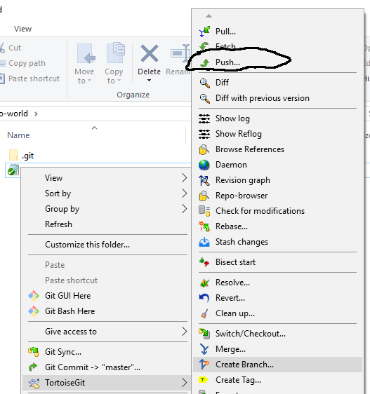

安装 git 和 tortoisegit
-----------------------

`参考 <tortoiseGit-tut.rst>`_ 

步骤0 创建repository
--------------------
**方法1**

登陆github 例如https://github.com/deepvisions 

1. 点击 repositories 

2. 点击 "New"

.. image:: img-github/github-create0.png

3. 输入项目名称

4. 点击 Create Repository

.. image:: img-github/github-create1.png

5. 复制url

**方法2**

1. 使用TortoiseGit 在本地创建一个新repository "hello-world"

.. image:: create-repo.png   

2. push 本地master 分支(branch) 到github 的 "hello-world" 的repository

步骤1 Clone Repository
----------------------
**从github clone hello-world repository** 

在github中点击 绿色"Clone or Download" 按钮后复制url

在客户端中点击 "git clone", 在弹窗中点击OK

.. image:: git-clone.png

.. image:: git-clone-ok.png

步骤2 创建新分支, 提交新功能
----------------------------
创建一个新分支readme-edits用于开发新功能或者修改bug。完成新功能后点击git-commit提交修改, 然后push 到hello-world     

步骤3 Pull Request 
------------------   
**在github上选择pull request**  

+-------------------------+-------------+
| 步骤                    | 截图        | 
+=========================+=============+
| 点击Pull Request tab    |  |pr-tab|   |
+-------------------------+-------------+
| 点击绿色                |             |
| Create Pull Request 按钮| |create-pr| |
+------------+------------+-------------+
| base branch 选择master  |             |
|                         |             |  
| compare branch 选择     |             |
| readme-edits            |             |
|                         |             | 
| 填写标题和变更表述      | |pr-form|   |
+------------+------------+-------------+

.. |pr-tab| image:: pr-tab.gif
   :height: 115 px
   :width: 425 px

.. |create-pr| image:: create-pr.png
   :height: 210 px
   :width: 425 px

.. |pr-form| image:: pr-form.png
   :height: 300 px
   :width: 425 px

步骤4 合并(Merge) Pull Request
-------------------------------
点击merge pull request按钮 

|merge-btn|
|delete-btn|

.. |merge-btn| image:: merge-button.png
   :height: 150 px
   :width: 800 px

.. |delete-btn| image:: delete-button.png
   :height: 100 px
   :width: 800 px

参考:

https://lab.github.com/githubtraining/introduction-to-github?overlay=register-box-overlay

https://guides.github.com/activities/hello-world/

