下载
-----
下载 git https://git-scm.com/download/win
下载 tortoiseGit https://tortoisegit.org/download/

安装
----
安装 tortoiseGit

点击"Next"

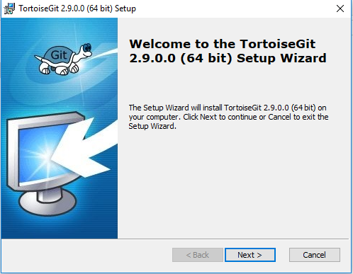
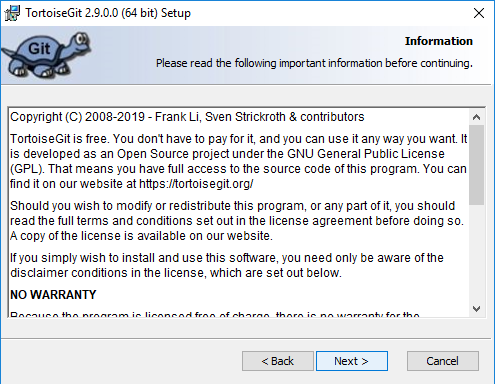
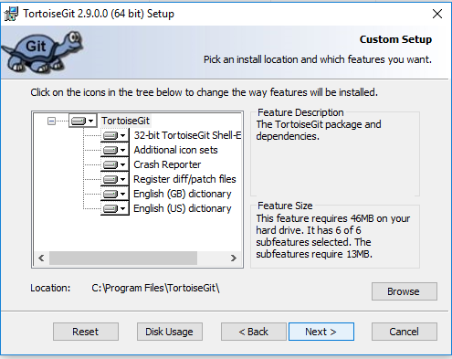

点击"Install"    

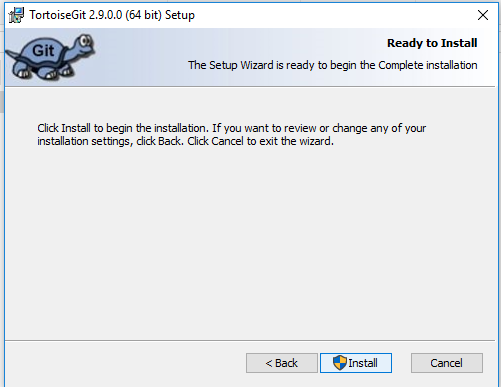
    
点击"Finish"    

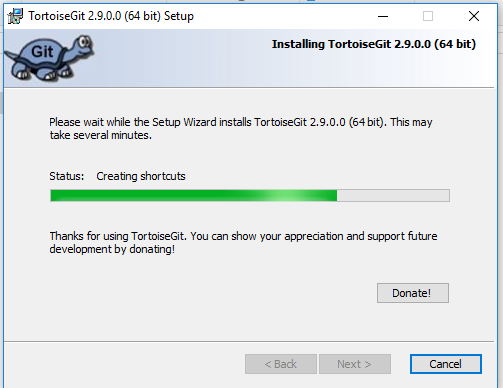
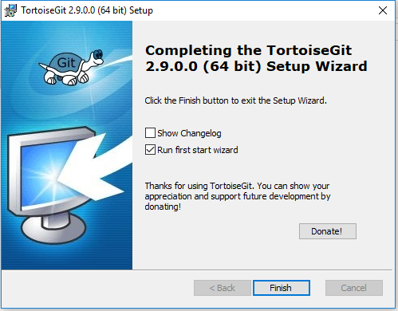

点击"Next"

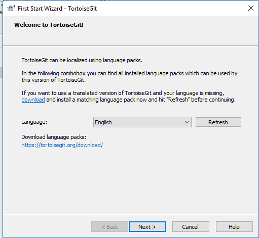
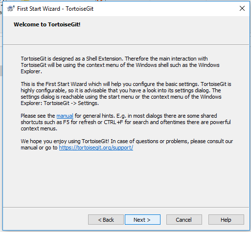
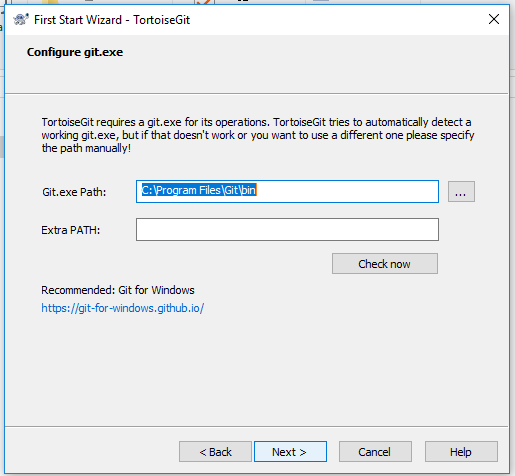

填写用户名和email    

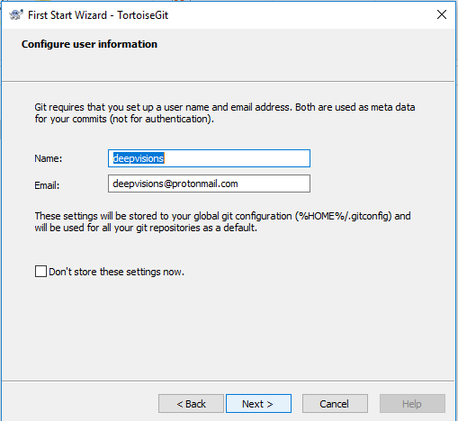

点击"Finish"    

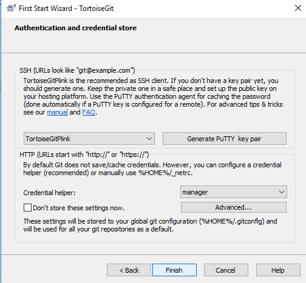
